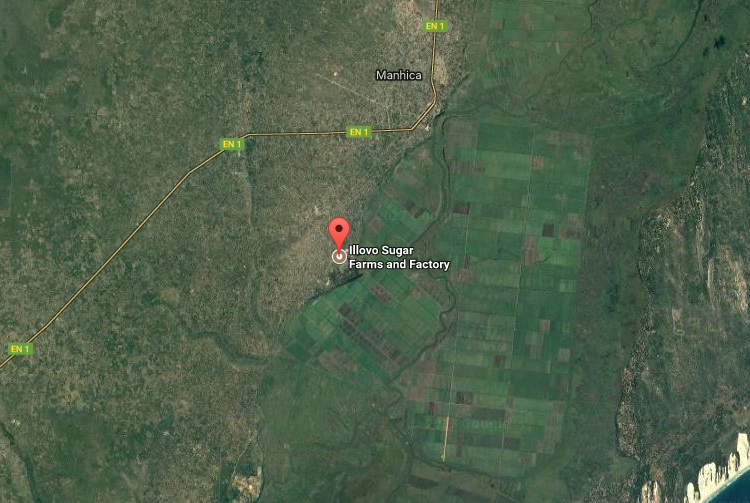
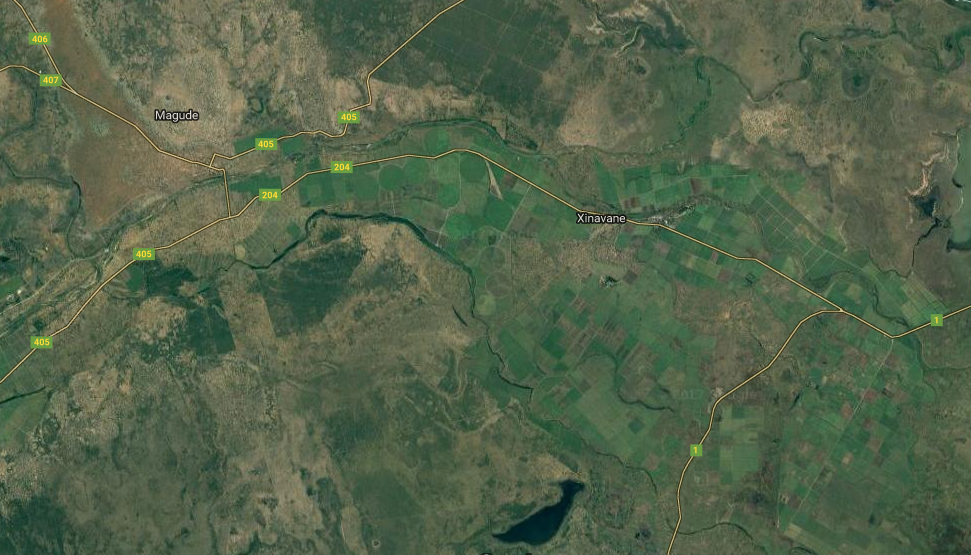

```{r, echo = FALSE, warning = FALSE, message = FALSE, comment = NA, error= FALSE, cache = FALSE}


# Packages
library(tidyverse)
library(knitr)
library(Hmisc)
library(brew)
library(maragra)
library(knitr)
library(googleVis)
library(RColorBrewer)
op <- options(gvis.plot.tag='chart')

## Global options
options(max.print="75")
opts_chunk$set(echo=FALSE,
	             cache=TRUE,
               prompt=FALSE,
               tidy=TRUE,
               comment=NA,
               message=FALSE,
               warning=FALSE)
opts_knit$set(width=75)
```


```{r}
# Read in data
ab <- maragra::ab
ab_panel <- maragra::ab_panel
bairros <- maragra::bairros
census <- maragra::census
clinic <- maragra::clinic
clinic_agg <- maragra::clinic_agg
mc <- maragra::mc
workers <- maragra::workers
```

```{r}
tablify <- function(x, n = 5){
  DT::datatable(x,
                selection = 'none',
                escape = FALSE,
                options = list(#sDom  = '<"top">lrt<"bottom">ip',
                               pageLength = n, 
                               dom = 'tip'))
}
kablify <- function(x, size = 12){
  require(kableExtra)
  kable(x,
        digits = 3) %>% 
  kable_styling(bootstrap_options = c("striped",
  "hover",
  "condensed"),
  font_size = size,
  position = 'float_left',
  full_width = FALSE)
}

make_kable <- function(x,
                       caption = NULL,
                       font_size = 12){
  require(kableExtra)
  require(knitr)
  kable(x,
        booktabs = TRUE,
        format = 'latex',
        digits = 2,
        row.names = FALSE,
        caption = caption,
        format.args = list(big.mark = ',')) %>%
    kable_styling(font_size = font_size)
  #%>%
  # kable_styling(latex_options = "scale_down")
}

# ## 
# 
# 
```

# Introduction


## The effect of malaria on the economy

- Traditional attempts to quantify effect are too clinical - basically just take the clinical cost of an illness and multiply by number of illnesses.  
- But there are microeconomic effects (short term changes in behavior when ill, acquisition of human capital) and macroeconomic affects (trade, productivity, tourism) that come as a result of pandemic malaria [@Sachs2002].  
- Impossible to truly capture the macro effects until you capture the micro effects.  

## The importance of large foreign firms in Mozambique 

- Significant sector of the economy is dominated by a full large-scale foreing direct investment projects [@Robbins2012, @German2013].   
- The Mozambican state has encouraged large-scale entreprise with the aim of general economic development [@Buur2012], partly for reasons of practicality, and partly out of a general notion of "corporate social responsibility" [@Azemar2009].  
- Indirectly, private industry plays an important role in public health in Mozambique [@Robbins2012, @CastelBranco2014].   

## The effect of malaria on business  

- Difficult to study because data are privately held and there is resistance to sharing.  
- Even when data are accessible, it's very hard to come up with suitable comparisons. - Observable effects (illness, etc.), and unobservable effects (lack of investment, etc.).   

# Context

## Manhiça and Magude

```{r}
library(sp)
a <- cism::mag2; a@data <- data.frame(x = 'Magude'); row.names(a) <- '1'
b <- cism::man2; b@data <- data.frame(x = 'Manhiça'); row.names(b) <- '2'
x <- rbind(a, b)
par(fmrow = c(1,2))
plot(cism::moz0)
plot(x, add = TRUE, col = c('red', 'yellow'))
plot(x, col = c('red', 'yellow'))
par(mfrow = c(1,1))
```

## Two large sugar companies

Maragra and Xinavane

<!--  -->
<!--  -->

\includegraphics[width=0.46\textwidth]{img/maragra}
\includegraphics[width=0.54\textwidth]{img/xinavane}

## Our questions  

- What is the effect of the malaria elimination campaign on worker absenteeism and health (and productivity)?  
- What is the effect of privately-run malaria control campaigns on worker absenteeism and health (and productivity)?    
- How much of a private good comes from public interventions?   
- How much public good comes from private interventions?  

# The data

## Data from 2 large sugarcane facilities  

### Xinavane

```{r}
xinavane <- readr::read_csv('../../../xinavane/xinavane_monthly_panel_with_census.csv')
xinavane <- xinavane %>%
  filter(month_start <= '2016-06-01') %>%
  mutate(eligibles = as.numeric(eligibles))

# Get absenteeism over time
xa <- xinavane %>%
  dplyr::group_by(month_start) %>%
  dplyr::summarise(absences = sum(absences, na.rm = TRUE),
                   sick_absences = sum(as.numeric(sick_absences), na.rm = TRUE),
            eligibles = sum(eligibles, na.rm = TRUE))

# Adjust denominator
xa$eligibles[xa$month_start >= '2016-01-01'] <- max(xa$eligibles[xa$month_start < '2016-01-01'])

xa$absenteeism_rate <- 
  xa$absences / 
  xa$eligibles * 100
xa$sick_absenteeism_rate <-
  xa$sick_absences /
  xa$eligibles * 100
```

- `r nrow(xinavane)` worker-days observed (`r round(nrow(xinavane) / 365.25)` years of human activity).    
- Work schedules, sociodemographic information, absences, sickness-attributed absences, worker residence, type of worker, IRS*...  

### Maragra

- `r nrow(ab_panel)` worker-days observed (`r round(nrow(ab_panel) / 365.25)` years of human activity).    
- Work schedules, sociodemographic information, absences, sickness-attributed absences, malaria laboratory tests, worker residence, type of worker, IRS...   

## Comparing the two sugarcanes over time

What is the effect of the elimination campaign on worker absenteeism?

```{r}
ma <- ab_panel %>%
  group_by(month_start = as.Date(paste0(format(date, '%Y-%m-'), '01'))) %>%
  dplyr::summarise(absences = sum(absent, na.rm = TRUE),
                   sick_absences = sum(absent_sick, na.rm = TRUE),
            eligibles = length(absent)) %>%
  ungroup %>%
  mutate(absenteeism_rate = absences / eligibles * 100) %>%
  mutate(sick_absenteeism_rate = sick_absences / eligibles * 100)
combined <- bind_rows(
  ma %>% mutate(Company = 'Maragra'),
  xa %>% mutate(Company = 'Xinavane')
)

cols <- rev(c('darkred', 'darkorange'))
g1 <- ggplot(data = combined,
       aes(x = month_start,
           y = absenteeism_rate,
           color = Company)) +
  geom_line() +
  scale_color_manual(name = 'Company',
                     values = cols) +
  theme_maragra() +
  labs(x = 'Month',
       y = 'Absenteeism rate',
       title = 'All absenteeism')
g2 <- ggplot(data = combined,
       aes(x = month_start,
           y = sick_absenteeism_rate,
           color = Company)) +
  geom_line() +
  scale_color_manual(name = 'Company',
                     values = cols) +
  theme_maragra() +
  labs(x = 'Month',
       y = 'Absenteeism rate',
       title = 'Sick absenteeism')
Rmisc::multiplot(g1, g2)
```


## Standardizing

What is the effect of the elimination campaign on worker absenteeism?

```{r}
# Set ot relative
combined <-
  combined %>%
  filter(month_start >= '2014-01-01') %>%
  group_by(Company) %>%
  mutate(pre_intervention_avg_absenteeism = sum(absences[month_start <= '2015-10-01']) /
           sum(eligibles[month_start <= '2015-10-01']) * 100,
         pre_intervention_avg_sick_absenteeism = sum(sick_absences[month_start <= '2015-10-01']) / 
           sum(eligibles[month_start <= '2015-10-01']) * 100) %>%
  ungroup %>%
  mutate(p_absenteeism = absenteeism_rate / pre_intervention_avg_absenteeism * 100,
         p_absenteeism_sick = sick_absenteeism_rate / pre_intervention_avg_sick_absenteeism * 100)


g1 <- ggplot(data = combined,
       aes(x = month_start,
           y = p_absenteeism,
           color = Company)) +
  geom_line() +
  scale_color_manual(name = 'Company',
                     values = cols) +
  theme_maragra() +
  labs(x = 'Month',
       y = '% of pre-interevention rate',
       title = 'All absenteeism (scaled)') +
  geom_hline(yintercept = 100, 
             color = 'grey',
             alpha = 0.6,
             lty = 2) +
  geom_vline(xintercept = as.numeric(as.Date('2015-10-01')))

g2 <- ggplot(data = combined,
       aes(x = month_start,
           y = p_absenteeism_sick,
           color = Company)) +
  geom_line() +
  scale_color_manual(name = 'Company',
                     values = cols) +
  theme_maragra() +
  labs(x = 'Month',
       y = '% of pre-interevention rate',
       title = 'Sick absenteeism (scaled)') +
  geom_hline(yintercept = 100, 
             color = 'grey',
             alpha = 0.6,
             lty = 2) +
  geom_vline(xintercept = as.numeric(as.Date('2015-10-01')))
Rmisc::multiplot(g1, g2)
```

## Bias - residence of worker

```{r}
# loc <- xinavane %>%
#   group_by(location_laia, month_start) %>%
#   dplyr::summarise(absences = sum(absences, na.rm = TRUE),
#                    sick_absences = sum(as.numeric(sick_absences), na.rm = TRUE),
#             eligibles = sum(eligibles, na.rm = TRUE))
# 
# # Adjust denominator
# loc$eligibles[loc$month_start >= '2016-01-01'] <- max(loc$eligibles[loc$month_start < '2016-01-01'])
# 
# loc$absenteeism_rate <- 
#   loc$absences / 
#   loc$eligibles * 100
# loc$sick_absenteeism_rate <-
#   loc$sick_absences /
#   loc$eligibles * 100
# 
# loc <- loc %>% filter(!is.na(location_laia))
# 
# ggplot(data = loc,
#        aes(x = month_start,
#            y = sick_absenteeism_rate,
#            color = location_laia)) +
#   geom_line()
x <- xinavane %>%
  group_by(Residence = location_laia) %>%
  summarise(Workers = length(unique(number))) %>%
  ungroup %>%
  mutate(Residence = ifelse(is.na(Residence), 
                            'Unknown',
                            Residence)) %>%
  mutate(Percentage = Workers / sum(Workers) * 100)
knitr::kable(x)
```

## Current status

- Obtaining and cleaning supplementary data  
- Refining analysis approaches  

# Maragra  

## The data

## IRS data - insecticide chemical


```{r}
ggplot(data = mc,
       aes(x = insecticida)) +
  geom_bar(fill = '#159957',
           alpha = 0.6) +
  theme_maragra() +
  labs(x = 'Insecticide',
       y = 'IRS activities',
       title = 'Maragra IRS activity by insecticide type')
```

## IRS data - insecticide use over time


```{r}
x <- mc %>%
  group_by(date = as.Date(paste0(format(date, '%Y-%m'), '-01')),
           insecticida) %>%
  summarise(houses = sum(casas_cobertas)) %>%
  ungroup
# Get a left side for filling in the 0s
left <- expand.grid(date = seq(min(x$date),
                               max(x$date),
                               by = 'month'),
                    insecticida = sort(unique(x$insecticida)))
# Join together
x <- left_join(x = left,
               y = x,
               by = c('date', 
                      'insecticida'))
# Replace NAs with 0
x <- x %>%
  mutate(houses = ifelse(is.na(houses), 0, houses))
# Define a color vector
cols <- colorRampPalette(brewer.pal(n = 9, 'Spectral'))(length(unique(x$insecticida)))

ggplot(data = x,
       aes(x = date,
           y = houses,
           group = insecticida,
           color = insecticida)) +
  geom_point(alpha = 0.6) +
  geom_line(alpha = 0.6) +
  theme_maragra() +
  labs(x = 'Month',
       y = 'Houses fumigated',
       title = 'Maragra IRS activity by insecticide type over time') +
  scale_color_manual(name = 'Chemical',
                     values = cols) +
  geom_vline(xintercept = as.numeric(as.Date(paste0(2012:2017, '-01-01'))),
             alpha = 0.2)
```

## Absenteeism data


```{r}
x <- 
  ab_panel %>%
  group_by(date) %>%
  summarise(absences = length(which(absent)),
            eligibles = length(absent)) %>%
  ungroup %>%
  mutate(absenteeism_rate = absences / eligibles * 100) %>%
  mutate(Workers = eligibles)

ggplot(data = x,
       aes(x = date,
           y = absenteeism_rate)) +
  geom_point(alpha = 0.1,
             color = '#159957',
             aes(size = Workers)) +
  geom_smooth() +
  theme_maragra() +
  labs(x = 'Date',
       y = 'Absenteeism rate',
       title = 'Absenteeism rate over time') 
  
```

## Clinical microscopy data


```{r}
x <- 
  clinic_agg %>%
  group_by(date) %>%
  summarise(p = sum(positive),
            pp = sum(positive) / sum(tested) * 100,
            tested = sum(tested))

# Gather into long format
y <- 
  rbind(x %>% dplyr::select(date, p) %>%
          rename(val = p) %>%
          mutate(key = 'positive'),
        x %>% dplyr::select(date, tested) %>%
          rename(val = tested) %>%
          mutate(key = 'tested')) %>%
  mutate(key = factor(key, levels = c('tested', 'positive')))

ggplot(data = x,
       aes(x = date,
           y = p)) +
  geom_bar(stat = 'identity') +
  xlab('Date') +
  ylab('Number of positive cases') +
    theme_maragra() +
  ggtitle('Malaria miscroscopy positive results',
          'All workers')
```

## Clinical microscopy data (b)


```{r}
ggplot(data = y,
       aes(x = date,
           y = val,
           group = key,
           fill = key)) +
  geom_bar(stat = 'identity', position = 'stack', alpha = 0.5) +
  xlab('Date') +
  ylab('Number of positive cases') +
  theme_maragra() +
  scale_fill_manual(name = '',
                    values = c('black', 'darkred')) +
  ggtitle('Malaria miscroscopy tests and positive results',
          'All workers, absolute') +
    theme(title = element_text(size = 12))
```


## Clinical microscopy data (c)

```{r}
ggplot(data = clinic,
       aes(x = severity)) +
  geom_bar(alpha = 0.6,
           fill = 'darkorange') +
  theme_maragra() +
  labs(x = 'Severity',
       y = 'Cases',
       title = 'Severity of all malaria cases: Maragra clinic')
```

## Identification strategy

- One intervention (IRS).  
- 2 outcomes (absence and illness).  
- Many confounders (age, worker type, seasonality, etc.).   


\begin{equation}
\operatorname{Pr}(\text{Outcome} = 1 \mid \text{X}) = \beta_{0} + \beta_{1} \text{Location} + \beta_{2} \text{Season} + (\beta_3{IRS}*\beta_4{IRS_t} + ... )
\end{equation}


## Propensity score matching

- Direct adjustment for confounders would greatly reduce the degrees of freedom of our analysis.  
- Instead, we employ propensity score matching to generate a matched sample of workers who are alike in characteristics and time, but not treatment.   

- Based on estimation of probability of treatment given a worker's age, sex, department and temporary vs. permanent status.   

## Propensity score matching - justification

```{r}
right_side <- irs %>%
  group_by(unidade) %>% 
  tally %>%
  ungroup %>%
  mutate(received = ifelse(n > 0, TRUE, FALSE))

left_side <-
  workers %>%
  dplyr::select(oracle_number, unidade, permanent_or_temporary, department, sex, date_of_birth)

psm <- left_join(x = left_side,
                 y = right_side,
                 by = 'unidade') %>%
  mutate(received = ifelse(is.na(received), FALSE, received)) %>%
  mutate(age = round((as.numeric(as.Date('2016-01-01') - date_of_birth)) / 365.25, digits = 2)) %>%
  filter(!is.na(sex),
         !is.na(age)) %>%
  dplyr::select(-unidade, -date_of_birth, -n)

psmt1 <- psm
names(psmt1) <- toupper(names(psmt1))
psmt1 <- psmt1 %>%
  mutate(RECEIVED = ifelse(RECEIVED == TRUE,'IRS', 'No IRS')) %>%
  mutate(STATUS = PERMANENT_OR_TEMPORARY)

pacman::p_load(tableone)
table1 <- CreateTableOne(vars = toupper(c('STATUS', 'department', 'age',
                                  'sex', 'received')), 
                         data = psmt1, 
                         factorVars = toupper(c('STATUS', 'department',
                                  'sex')), 
                         strata = 'RECEIVED')
table1 <- print(table1, 
                printToggle = FALSE, 
                noSpaces = TRUE)
# table1$Variable <- row.names(table1)
x <- data.frame(table1[,1:3])
x$Variable <- row.names(x)
x <- x[,c('Variable', 'IRS', 'No.IRS', 'p')]
row.names(x) <- NULL
knitr::kable(x,
           caption = 'The need for propensity score matching') %>%
  kableExtra::kable_styling(font_size = 12)
```


## Match results

Sample sizes

```{r}
library(MatchIt)
set.seed(1234)
match.it <- matchit(received ~ age + sex + permanent_or_temporary + department, data = psm, method="nearest", ratio=1)
a <- b <- summary(match.it)
a <- data.frame(a$nn)
a$Status <- row.names(a)
a <- a[,c('Status', 'Control', 'Treated')]
```

```{r}
knitr::kable(a)
```

## Group similarity  

Summary of balance for matched data

```{r}
b <- data.frame(b$sum.matched[c(1:4)])
rn <- names(b)
b$Variable <- row.names(b)
b <- b[,c('Variable', rn)]
row.names(b) <- NULL
b$Variable[b$Variable == 'permanent_or_temporaryTemporary'] <- 'Temporary'
b$Variable[b$Variable == 'departmentFactory'] <- 'Factory'
b$Variable[b$Variable == 'departmentField'] <- 'Field'
b$SD.Control <- NULL
knitr::kable(b, digits = 2, format.args = list(big.mark = ',')) 
```


## Group similarity  

```{r}
plot(match.it, type = 'jitter', interactive = FALSE, col = adjustcolor('darkblue', alpha.f  =0.3))
```

```{r}
# Save matched samples
matched <- match.data(match.it)[1:ncol(psm)]
```

## Visual results

```{r}
if('aes_maragra_temp.RData' %in% dir()){
  load('aes_maragra_temp.RData')
} else {
  # Create model data
  model_data <-
    ab_panel %>%
    filter(oracle_number %in% matched$oracle_number) %>%
    left_join(irs) %>%
    left_join(matched) %>%
    mutate(days_since_numeric = days_since) %>%
    mutate(months_since = days_since %/% 30) %>%
    mutate(months_since = ifelse(is.na(months_since) | is.infinite(months_since) | months_since >= 10,
                                 '>9',
                                 as.character(months_since))) %>%
    mutate(days_since = ifelse(is.na(days_since), 'Never',
                               ifelse(days_since > 180, '180+',
                                      ifelse(days_since > 90, '090-180',
                                             ifelse(days_since > 30, '030-090',
                                                    '<030'))))) %>%
    mutate(quarter = lendable::quarter_extract(date)) %>%
    mutate(quarter = as.character(quarter)) %>%
    mutate(absent_sick = ifelse(is.na(absent_sick), FALSE, absent_sick)) %>%
    # Get census data
    left_join(workers %>%
                dplyr::select(perm_id,
                              oracle_number)) %>%
    left_join(census %>%
                dplyr::select(perm_id, 
                              maragra_bairro,
                              maragra_fabrica)) %>%
    # Make season
    mutate(season = ifelse(quarter == '1', '1. Jan-Mar',
                           ifelse(quarter == '2', '2. Apr-Jun',
                                  ifelse(quarter == '3', '3. Jul-Sep',
                                         ifelse(quarter == '4', '4. Oct-Dec', 
                                                NA))))) %>%
    mutate(simple_season = ifelse(quarter %in% c('1'), 'High', 'Low')) 
  
  # Need to add seasonality
  # Need to adjust for houses on and off site
  fit <- glm(absent ~ days_since + simple_season,
             family = binomial('logit'),
            data = model_data)
  x <- exp(coef(fit))
  ors <- exp(confint(fit))
  ors <- data.frame(ors)
  names(ors) <- c('Lower', 'Upper')
  
  ors <- cbind(x, ors)
  ors$Variable <- row.names(ors)
  ors <- ors %>%
    dplyr::rename(OR = x) %>%
    dplyr::select(Variable, OR, Lower, Upper)
  
  save(model_data,
       fit,
       x,
       ors,
       file = 'aes_maragra_temp.RData')
}

```

```{r}
x <- model_data %>%
  filter(maragra_bairro) %>%
  # filter(days_since != 'Never') %>%
  group_by(months_since, 
           oracle_number) %>%
  summarise(absences = length(which(absent)),
            sick_absences = length(which(absent_sick)),
            eligibles = length(absent)) %>%
  ungroup %>%
  mutate(absenteeism_rate = absences / eligibles * 100,
         sick_absenteeism_rate = sick_absences / eligibles * 100)

ggplot(data = x %>%
         filter(months_since != '>9'),
       aes(x = months_since,
           y = sick_absenteeism_rate)) +
  geom_jitter(alpha = 0.3) +
  geom_boxplot(alpha = 0.6,
               fill = NA) +
  scale_y_log10() +
  theme_maragra() +
  labs(x = 'Months since IRS',
       y = 'Sick absenteeism rate (log scale)') +
  geom_smooth(aes(group = 1))
```

## Visual results (b)

```{r}
y <- model_data %>%
  group_by(days_since_numeric) %>%
    summarise(absences = length(which(absent)),
            sick_absences = length(which(absent_sick)),
            eligibles = length(absent),
            Workers = length(unique(oracle_number))) %>%
  ungroup %>%
  mutate(absenteeism_rate = absences / eligibles * 100,
         sick_absenteeism_rate = sick_absences / eligibles * 100)

g1 <- ggplot(data = y,
       aes(x = days_since_numeric,
           y = sick_absenteeism_rate)) +
  geom_point(aes(size = Workers),
             alpha = 0.4) +
  geom_smooth() +
  theme_maragra() +
  labs(x = 'Days since IRS',
       y = 'Sick absenteeism rate')
g1
# g2 <- ggplot(data = y,
#        aes(x = days_since_numeric,
#            y = absenteeism_rate)) +
#   geom_point() +
#   geom_smooth() +
#   theme_maragra() +
#   labs(x = 'Days since IRS',
#        y = 'Absenteeism rate')
# Rmisc::multiplot(g1, g2)
```

## Bias - time of year

```{r}
x <- mc %>%
  group_by(year, day_number) %>%
  summarise(houses = sum(casas_cobertas)) %>%
  ungroup %>%
  mutate(fake_date = as.Date('1990-01-01') + day_number) %>%
  mutate(fake_month = as.Date(paste0(format(fake_date, '%Y-%m'), '-01'))) %>%
  group_by(year, fake_month) %>%
  summarise(houses = sum(houses)) %>%
  ungroup %>%
  mutate(year = factor(year))

# Fill the nas with 0s
left <- expand.grid(year = sort(unique(x$year)),
                    fake_month = sort(unique(x$fake_month)))

x <- left_join(x = left,
               y = x)
x$houses[is.na(x$houses)] <- 0
cols <- colorRampPalette(brewer.pal(n = 9, 'Spectral'))(length(unique(x$year)))
ggplot(data = x %>% 
         filter(!year %in% c(2011:2012, 2017)),
       aes(x = fake_month,
           y = houses)) +#,
           # group = year,
           # color = year)) +
  geom_line(alpha = 0.8) +
  # scale_color_manual(name = 'Year',
  #                    values = cols) +
  scale_x_date(labels = scales::date_format("%b")) +
  theme_maragra() +
  labs(x = 'Month',
       y = 'Houses covered',
       title = 'Seasonality of IRS operations') +
  facet_wrap(~year)
```

## Modeling


Since IRS is not random throughout the year, we need to adjust for seasonality.  

```{r}
# Combine into a df
row.names(ors) <- NULL
kablify(ors)
```

## Sick absence only

We run the same model, but instead of estimating absences, we estimate only the likelihood of sick absences. The results (in form of odds ratios) are below.

```{r}
if('aes_maragra_temp2.RData' %in% dir()){
  load('aes_maragra_temp2.RData')
} else {
  
  # Need to add seasonality
  # Need to adjust for houses on and off site
  fit <- glm(absent_sick ~ days_since + simple_season,
             family = binomial('logit'),
            data = model_data)
  x <- exp(coef(fit))
  ors <- exp(confint(fit))
  ors <- data.frame(ors)
  names(ors) <- c('Lower', 'Upper')
  
  ors <- cbind(x, ors)
  ors$Variable <- row.names(ors)
  ors <- ors %>%
    dplyr::rename(OR = x) %>%
    dplyr::select(Variable, OR, Lower, Upper)
  save(fit,
       x,
       ors,
       file = 'aes_maragra_temp2.RData')
}

# Combine into a df
row.names(ors) <- NULL
knitr::kable(ors)
```

## Challenges

- Methodological: How to define treatment better 
  -When should we consider the effect of IRS to begin? 
  -Should we quantify waning IRS a priori or solely through observation?  
- Conceptual: How to better construct our panel  
  -One person is observed in different treatment states at different times, and to different degrees  
  - Matching with others vs. matching with self  
- Identification: How to better control for bias  
  - Clinical malaria is different from malaria  
  - Treatment is not random, but its causal factors are difficult to observe  
  - Malaria is seasonal, making it hard to parse the effect of time passing (ie, high season ending) from IRS waning  

## References {.allowframebreaks}

